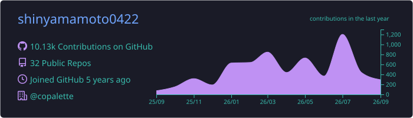
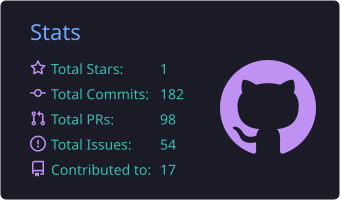
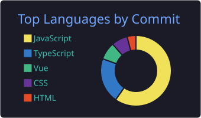

<p align="center">
  <a href="https://www.copalette.org/"></a>
  <a href="https://x.com/Shin_Yamamoto21"></a>
  <a href="https://github.com/copalette"></a>
</p>

<p align="center">
  <b>Every Person, A Creator.</b><br />
  ハッカソンプラットフォームから AI エージェントの開発基盤まで、「つくる人」を支えるプロダクトを作っています。
</p>

---

### 👋 About

```yaml
name:      Shin Yamamoto
role:      Founder @ CoPalette Inc.
previous:  PLAID (@plaidev)
education: 同志社大学 (2026 卒)
base:      Tokyo, Japan 🇯🇵
focus:     [Hackathon Platform, AI Coding Agents, Company Context for AI, Urban Data]
currently: Claude Code / Codex CLI を相棒に、少人数で複数プロダクトを回しています
```

### 🚀 What I'm Building

| Product | |
| :-- | :-- |
| 🏟️ **[CraftStadium](https://craftstadium.com)** | ハッカソンプラットフォーム。参加者向けの **CraftStadium** と主催者向けの **[CraftStadium Organize](https://organize.craftstadium.com)** で、開催から参加・審査まで一気通貫で支えます。Web / iOS / Android / MCP まで一つのモノレポで開発。 |
| 🔭 **[CraftStadium Lens](https://github.com/copalette/craftstadium-lens)** `OSS` | AI コーディングエージェント向けの local-first CLI（`cslens`）。Claude Code のセッションから「自分が何度も言っている指示」を見つけて、`CLAUDE.md` のルールや hooks の候補にします。Anthropic の auto-memory を補完するツールです。 |
| 🧠 **[TobariAI](https://tobari.ai)** | 会議・メール・文書から会社の判断・ルール・仕事のやり方をため、どれが今も正しいかを保ったまま、社員が使う AI に渡すサービス。 |
| 🏙️ **[Tobari](https://tobari.io)** | 「個人は見ない。まちの動きを見る。」匿名の通行量データで、自治体の意思決定を支える都市データ基盤。 |

### 🛠️ Tech Stack

**Languages**

<p>
  
</p>

**Frontend / Mobile**

<p>
  
</p>

**Backend / Infra**

<p>
  
</p>

**AI**

<p>
  
  
  
  
</p>

### 📊 GitHub Stats

<p align="center">
  
</p>

<p align="center">
  
  
</p>

<p align="center">
  
</p>

### 🧭 Journey

- **Now** — CoPalette Inc. Founder。CraftStadium / TobariAI / Tobari を開発
- **2026** — 同志社大学 卒業
- **Before** — PLAID (@plaidev)

### 📫 Connect

<p>
  <a href="https://x.com/Shin_Yamamoto21"></a>
  <a href="https://www.copalette.org/"></a>
  <a href="https://craftstadium.com"></a>
</p>

ハッカソンの共催・スポンサー、CraftStadium Lens へのフィードバック、プロダクトの壁打ち、気軽にどうぞ。


